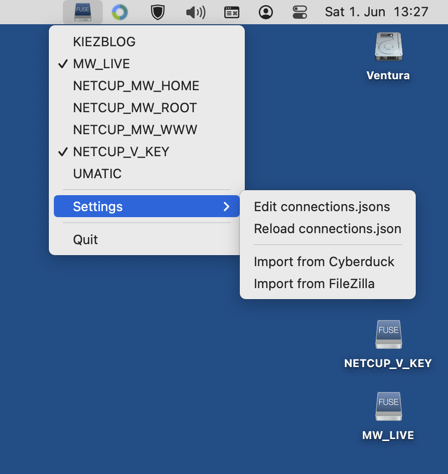

# Mac-SSHFS-Mounter

Mac-SSHFS-Mounter is a small System Menu application for macOS that allows to mount and unmount [SSHFS](https://github.com/libfuse/sshfs) drives. It depends on [macFUSE](https://osxfuse.github.io/).

## Setup and usage

* Install [macFUSE](https://osxfuse.github.io/).
* Download and run [Mac-SSHFS-Mounter](https://github.com/59de44955ebd/Mac-SSHFS-Mounter/releases).
* Configured SSHFS-connections/drives can be mounted/unmounted directly from the system menu.
* Connections are stored in a simple JSON file called "connections.json" in folder ~/Library/Application\ Support/SSHFS-Mounter. You can either edit this file manually or import existing SSH/SFTP connections from [FileZilla](https://filezilla-project.org/) or [Cyberduck](https://duck.sh/).

## Format of connections.json

JSON file connections.json contains an array of objects/dicts, where each object must have the following 6 string keys:

* "name": The display name of this connection in the menu, as well as the name of the mounted drive/volume
* "host": The remote hostname or IP
* "port": The remort port, usually 22 for SSH
* "user": The username on the remote system
* "auth": The authentication method, either "key" (based on a private key file), "ask_password" (which means ask for password every time when connecting) or "password" (which means: ask for password when connecting for the first time, then store it inside the JSON file using some (rather weak) encryption.
* "path": The path on the remote system, e.g. "/" or "/var/www"

When "auth" is "key", there also has to be a key named "key_file", and its corresponding value must contain the path to a OpenSSH private key file on the local machine, so e.g. "~/.ssh/id_rsa".

Minimal example connections.json with 3 connection configurations:
```
[
    {
        "name": "MY_SERVER_1",
        "host": "foo.bar.com",
        "port": "22",
        "user": "johndoe1",
        "auth": "key",
        "key_file": "~/.ssh/id_rsa_johndoe1",
        "path": "/var/www"
    },
    {
        "name": "MY_SERVER_2",
        "host": "11.22.33.44",
        "port": "22",
        "user": "johndoe2",
        "auth": "ask_password",
        "path": "/home/johndoe2"
    },
    {
        "name": "MY_SERVER_3",
        "host": "foobar.org",
        "port": "2022",
        "user": "johndoe3",
        "auth": "password",
        "password": "4c7f6c5c0e7802116630110e5d580c045752050f5210262e160d10285a49244b",
        "path": "/"
    }
]
```
## Screenshots

*Mac-SSHFS-Mounter in the System Menu (macOS 13 Ventura)*  

